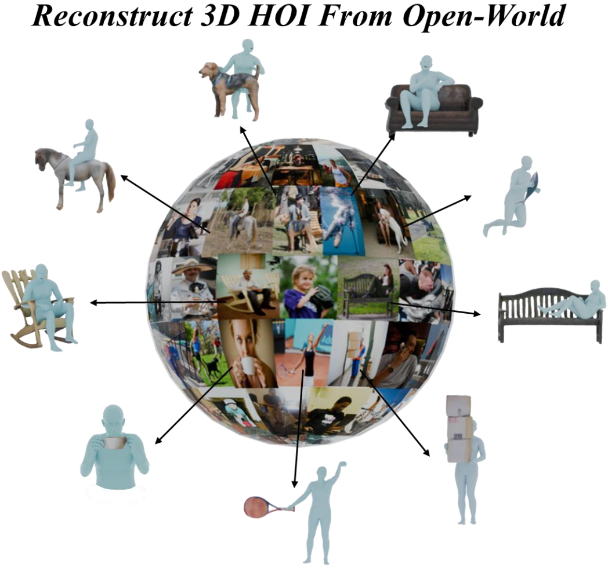

# Reconstructing In-the-Wild Open-Vocabulary Human-Object Interactions


## [Project Page](https://wenboran2002.github.io/3dhoi/) &nbsp;|&nbsp; [Paper](https://arxiv.org/abs/2503.15898) 



Implementation for the paper: `Reconstructing In-the-Wild Open-Vocabulary Human-Object Interactions`.

## ✅ToDo
 - [x] [2025/03/29] Release Open3DHOI dataset.
 - [ ] Pipeline for automatic coarse annotation.
 - [x] Code for HOI-Gaussian Optimizer.
## 🤗Dataset
You can download our Open3DHOI dataset from [huggingface](https://huggingface.co/datasets/acane2/Open3DHOI). The Dataset Structure is as follow:
```bash
- motorcycle
  - HICO_train2015_00013672
    - smplx_parameters.json # SMPL-X parameters
    - h_mesh.obj # Human mesh
    - object_mesh.obj # Object mesh
    - image.jpg # Image
    - person_mask.png # Person mask save as grayscale image
    - object_mask.png # Object mask save as grayscale image
    - depth.png # Depth generated by ZoeDepth
    - box_annotation.json # Bounding box annotation for human and object
```

## Enviroment Setup
```bash
conda create -n open3dhoi python=3.10
conda activate open3dhoi

## install cuda and pytorch following InstantMesh

# Install the correct version of CUDA
conda install cuda -c nvidia/label/cuda-12.1.0

# You may need to install another xformers version if you use a different PyTorch version
pip install torch==2.1.0 torchvision==0.16.0 torchaudio==2.1.0 --index-url https://download.pytorch.org/whl/cu121
pip install xformers==0.0.22.post7

# Initialize and update git submodules
git submodule update --init --recursive

pip install submodules/diff-gaussian-rasterization
pip install submodules/simple-knn
pip install --upgrade https://github.com/unlimblue/KNN_CUDA/releases/download/0.2/KNN_CUDA-0.2-py3-none-any.whl
pip install submodules/multiperson/sdf


pip install -r requirements.txt
```

## HOI-Gaussian Optimizer
### Prepares
#### Install
1. Install pytorch3d from https://github.com/facebookresearch/pytorch3d 
2. download SMPL-X model from https://smpl-x.is.tue.mpg.de/ and put it in /HOIGaussian/data
#### Data
1. camera data:
get calibration.json and extrinsic.json
```
python prepare/camera.py --data_dir ./test_data/sheep
```
2. normals data:
get normals_smplx.npy
```
python prepare/normals.py --data_dir ./test_data/sheep
```
### Test
```bash
cd /HOIGaussian
mkdir ./output
sh test.sh 
```
you can see the results in /HOIGaussian/output/


## Citation
```bibtex
@misc{wen20253dhoi,
      title={Reconstructing In-the-Wild Open-Vocabulary Human-Object Interactions}, 
      author={Boran Wen and Dingbang Huang and Zichen Zhang and Jiahong Zhou and Jianbin Deng and Jingyu Gong and Yulong Chen and Lizhuang Ma and Yong-Lu Li},
      year={2025},
      eprint={2503.15898},
      archivePrefix={arXiv},
      primaryClass={cs.CV},
      url={https://arxiv.org/abs/2503.15898},
}
```
