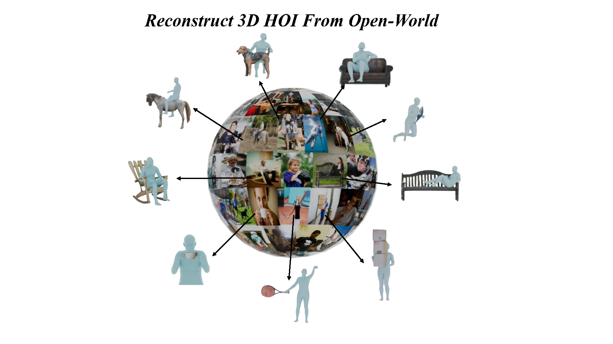

# Reconstructing In-the-Wild Open-Vocabulary Human-Object Interactions


## [Project Page](https://wenboran2002.github.io/3dhoi/) &nbsp;|&nbsp; [Paper](https://arxiv.org/) 



Implementation for the paper: `Reconstructing In-the-Wild Open-Vocabulary Human-Object Interactions`.

## Regarding Code Release
- The code will be updated and available soon.
<!-- ## News -->

## Citation
```bibtex
@misc{david,
      title={Reconstructing In-the-Wild Open-Vocabulary Human-Object Interactions}, 
      author={},
      year={},
      eprint={},
      archivePrefix={arXiv},
      primaryClass={cs.CV},
      url={}, 
}
```